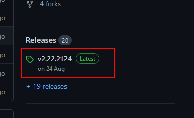

++++

++++

= mod.io Unreal Engine Legacy UE5 UI Plugin

image:https://img.shields.io/badge/license-MIT-brightgreen.svg[alt="License", link="https://github.com/modio/modio-sdk/blob/master/LICENSE"]
image:https://img.shields.io/discord/389039439487434752.svg?label=Discord&logo=discord&color=7289DA&labelColor=2C2F33[alt="Discord", link="https://discord.mod.io"]
image:https://img.shields.io/badge/docs-master-green.svg[alt="Master Docs", link="https://go.mod.io/ue-docs"]
image:https://img.shields.io/badge/Unreal-5.2%2B-green[alt="Unreal Engine", link="https://www.unrealengine.com"]

Welcome to the mod.io Unreal Engine Legacy UE5 UI repository. This repository is intended for the use of developers who were using our previous UE5 UI implementation who wish to continue to do so, but update their mod.io core plugin to take advantage of new functionality.  

== Engine & Platform Compatibility

This plugin requires the core mod.io plugin to be installed alongside it. As it is a legacy implementation intended for existing consumers, there will be no further updates to the implementation or engine compatibility.

=== Engine compatibility

|===
|Engine Version | Last Release
|UE5.2 | Current
|UE5.3 | Current
|===

== Installation

=== Prerequisites

. This plugin relies on the mod.io core plugin, available at https://github.com/modio/modio-ue. Please ensure you have downloaded and installed and configured the plugin prior to installing the Legacy UI plugin. 

=== Adding plugin files to your project
==== As a git submodule

. Add this repository as a submodule to your repository in your project's `Plugins/ModioLegacyUI` directory
+
In the directory with your .uproject file: `git submodule add https://github.com/modio/modio-ue-legacy-ui Plugins/ModioLegacyUI`
. Initialize our submodules with `git submodule update --init --recursive`

==== In a non-git project, or without submodules

. Grab the latest release zip from the Releases section on this page, and extract the contents to your project's `Plugins/ModioLegacyUI` directory

 image:Doc/img/get_latest_release2.png[]

NOTE: The automatically generated zips on the release page and the 'Code' dropdown on this page will not work if this repository adds submodule dependencies in future releases. Please use the attached archive on the release instead. 

== Game studios and Publishers [[contact-us]]

If you need assistance with 1st party approvals, or require a private, white-label UGC solution. mailto:developers@mod.io[Contact us] to discuss.

== Contributions Welcome

Our Unreal Engine plugins are public and open source. Game developers are welcome to utilize them directly, to add support for mods in their games, or fork them for their games customized use. Want to make changes to our plugins? Submit a pull request with your recommended changes to be reviewed.

== Other Repositories

Our aim with https://mod.io[mod.io], is to provide an https://docs.mod.io[open modding API]. You are welcome to https://github.com/modio[view, fork and contribute to our other codebases] in use.

